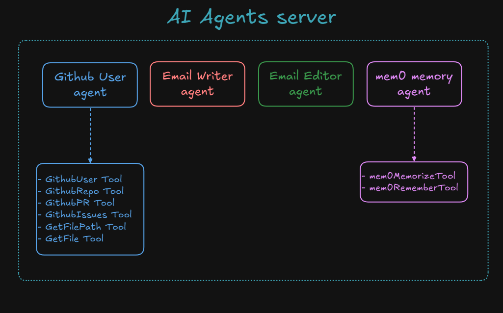
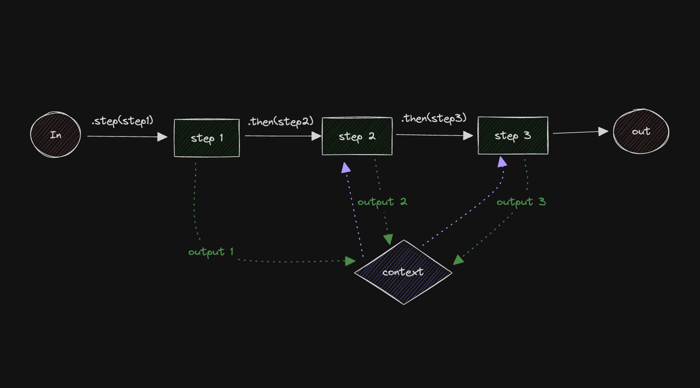
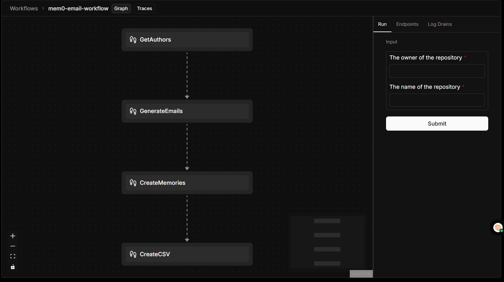

# mem0 AI Memory Layer with Mastra AI Framework

This repository integrates the Mastra AI TypeScript framework with mem0 as an AI memory layer, creating a powerful backend solution with persistent memory capabilities across different agents. While also executing the user queries and generating the output.

## Project Overview

This project implements four specialized AI agents that can leverage both Mastra's agent capabilities and mem0's memory persistence:

## Agents server  Architecture


<div align="center">
  
</div>

1. **Github Agent**: Interacts with users for GitHub-related queries including repository analysis, user profiles, pull requests, issues, and code exploration.
2. **Email Agent**: Generates professional, personalized emails with formatting capabilities.
3. **Editor Agent**: Edits and improves email content while maintaining the core message.
4. **Mem0 Agent**: Manages the memory layer to store and retrieve information across conversations.

The system also includes a comprehensive workflow that combines these agents to create a GitHub repository analysis and email campaign system.

### Tools

- **GithubUser Tool**: Fetch user profiles, repositories, and contribution stats
- **GithubRepo Tool**: Access repository information, contributors, and metadata
- **GithubPR Tool**: Get pull request details and activity  
- **GithubIssues Tool**: Retrieve issue details and discussions
- **GetFilePath Tool**: Navigate repository structure
- **GetFile Tool**: Access file contents and metadata
- **mem0MemorizeTool**: Save structured information to the mem0 memory layer
- **mem0RememberTool**: Retrieve information from the mem0 memory

### Workflows

| Workflow Design | Workflow Architecture |
|:---------------:|:---------------------:|
|  |  |
| *Workflow process from repository analysis to memory storage* | *Technical implementation of the workflow components* |

The project includes a comprehensive `mem0Workflow` that:

1. Analyzes a GitHub repository to identify contributors
2. Generates personalized emails to contributors about mem0.ai
3. Edits emails for professional formatting
4. Stores all campaign data in the mem0 memory layer

## Installation

1. Clone the repository:
```bash
git clone https://github.com/yashksaini-coder/mastra-mem0-backend.git
```

2. Install dependencies:
```bash
npm install
```

3. Set up environment variables in a `.env` file:
```
MEM0_API_KEY=your_mem0_api_key
GITHUB_TOKEN=your_github_token
GROQ_API_KEY=your_groq_api_key
```

4. Run the project:
```bash
mastra dev or npm run dev
```

## Testing the Project

### Testing Individual Agents

You can test each agent individually using the Mastra playground or via API calls:

```bash
# Start the Mastra playground
mastra dev --dir src
```

Access the playground at http://localhost:4111

### Testing the GitHub Agent

```bash
curl -X POST http://localhost:4111/api/agents/GithubAgent/generate \
  -H "Content-Type: application/json" \
  -d '{
    "messages": [
      { "role": "user", "content": "Get information about the user octocat" }
    ]
  }'
```

### Testing the Email Agent

```bash
curl -X POST http://localhost:4111/api/agents/EmailAgent/generate \
  -H "Content-Type: application/json" \
  -d '{
    "messages": [
      { "role": "user", "content": "Write an email to John about AI technology trends" }
    ]
  }'
```

### Testing the Mem0 Agent

```bash
curl -X POST http://localhost:4111/api/agents/mem0Agent/generate \
  -H "Content-Type: application/json" \
  -d '{
    "messages": [
      { "role": "user", "content": "Remember that my favorite color is blue" }
    ]
  }'
```

### Testing the Workflow

```bash
curl -X POST http://localhost:4111/api/workflows/mem0-email-workflow/trigger \
  -H "Content-Type: application/json" \
  -d '{
    "owner": "facebook",
    "repo": "react"
  }'
```

## Project Structure

```
src/
├── mastra/
│   ├── agents/
│   │   └── index.ts             # Agent definitions
│   ├── integrations/
│   │   └── index.ts             # mem0 integration setup
│   ├── instructions/
│   │   └── gh-user.ts           # GitHub agent instructions
│   ├── tools/
│   │   ├── GithubUser.ts        # GitHub user profile tool
│   │   ├── GithubRepo.ts        # Repository analysis tool
│   │   ├── GithubPR.ts          # Pull request tool
│   │   ├── GithubIssues.ts      # Issues tool
│   │   ├── GetFile.ts           # File content retrieval tool
│   │   ├── GetFilePath.ts       # File path navigation tool
│   │   └── mem0.ts              # Memory tools using mem0
│   ├── workflows/
│   │   └── index.ts             # Workflow definition
│   └── index.ts                 # Mastra initialization
├── utils/                       # Utility functions
└── types/                       # TypeScript type definitions
```

## Features

- **GitHub Repository Analysis**: Analyze repositories, contributors, and code
- **Email Generation**: Create personalized professional emails
- **Email Editing**: Format and improve email content
- **Memory Persistence**: Store and retrieve information across sessions
- **Workflow Automation**: Combine multiple AI agents in a structured workflow
- **Structured Data Storage**: Store complex data structures in mem0

<a href="https://github.com/yashksaini-coder">
    <table>
        <tbody>
            <tr>
                <td align="left" valign="top" width="14.28%">
                    
                    <br/>
                    <h4 align="center">
                        <b>Yash K. Saini</b>
                    </h4>
                    <div align="center">
                        <p>(Author)</p>
                    </div>
                </td>
                <td align="left" valign="top" width="85%">
                    <p>
                        👋 Hi there! I'm <u><em><strong>Yash K. Saini</strong></em></u>, a self-taught software developer and a computer science student from India.
                    </p>
                    <ul>
                     <li>
                        I love building & contributing to Open Source software solutions & projects that help solve real-world problems.
                    </li>
                    <li>
                        I want to build products & systems that can benefit & solve problems for many other DEVs.
                    </li>
                </td>
            </tr>
        </tbody>
    </table>
</a>

<p align="center">
    <strong>🌟 If you find this project helpful, please give it a star on GitHub! 🌟</strong>
</p>